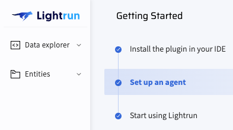
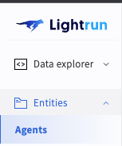

<p align="center">
    <a href="https://www.lightrun.com/" target="_blank">
      
    </a>
</p>

# [Lightrun](lightrun.com) Kubernetes Operator

[](https://github.com/lightrun-platform/lightrun-k8s-operator/actions/workflows/release.yaml/) 
[](https://github.com/lightrun-platform/lightrun-k8s-operator/actions/workflows/e2e.yaml)

The **Lightrun Kubernetes Operator** simplifies inserting Lightrun agents into your K8s workloads without modifying your Docker images or Kubernetes manifests. Built using [operator-sdk](https://sdk.operatorframework.io/) and following the Kubernetes [Operator pattern](https://kubernetes.io/docs/concepts/extend-kubernetes/operator/).

Table of contents
=================

<!--ts-->
   * [Description](#description)
   * [Example](#example)
   * [Example with Helm Chart](#example-with-helm-chart)
   * [Limitations](#limitations)
   * [Contributing Guide ](#contributing-guide)
   * [Licence](#license)
<!--te-->


## Description

The Lightrun K8s Operator automates the two steps needed to add a Lightrun agent to your Kubernetes applications:
1. Install the agent into the Kubernetes pod
2. Configure the running application to use the installed agent

For more details on how this works, see our [technical documentation](https://github.com/lightrun-platform/lightrun-k8s-operator/blob/main/docs/how.md).

> **Important:** [Read this before deploying to production](https://github.com/lightrun-platform/lightrun-k8s-operator/blob/main/docs/before_prod.md).

### Requirements
- Kubernetes >= 1.19

### Example

To set up the Lightrun K8s operator:

1. Create namespaces for the operator and test deployment:
   ```sh
   kubectl create namespace lightrun-operator
   kubectl create namespace lightrun-agent-test
   ```
   > Note: The `lightrun-operator` namespace is hardcoded in the example `operator.yaml` due to Role and RoleBinding objects.
   > To deploy the operator to a different namespace, use the Helm chart installation method.

2. Deploy the operator:
   ```sh
   kubectl apply -f https://raw.githubusercontent.com/lightrun-platform/lightrun-k8s-operator/main/examples/operator.yaml -n lightrun-operator
   ```  

3. Create a test deployment:
   ```sh
   kubectl apply -f https://raw.githubusercontent.com/lightrun-platform/lightrun-k8s-operator/main/examples/deployment.yaml -n lightrun-agent-test
   ```
   > The test application source code is available at [PrimeMain.java](../examples/app/PrimeMain.java)

4. Download Lightrun agent config and lightrun-secret
    ```sh
    curl https://raw.githubusercontent.com/lightrun-platform/lightrun-k8s-operator/main/examples/lightrunjavaagent.yaml > agent.yaml

    curl https://raw.githubusercontent.com/lightrun-platform/lightrun-k8s-operator/main/examples/lightrun-secret.yaml > lightrun-secret.yaml
    ```

5. Configure your Lightrun credentials:

   **In `agent.yaml`:**
   ```yaml
   # Update the serverHostname field
   serverHostname: "app.lightrun.com"  # For SaaS deployment
                                       # For on-prem deployment, use your own hostname
   ```

   **In `lightrun-secret.yaml`:**
   ```yaml
   # Update the following fields:
   lightrun_key: "your-lightrun-key"   # Find this on the Lightrun setup agent page
   pinned_cert_hash: "your-cert-hash"  # Obtain from https://<serverHostname>/api/getPinnedServerCert
                                       # Note: Authentication required
   ```

   

6. Create the agent custom resource:
   ```sh
   kubectl apply -f lightrun-secret.yaml -n lightrun-agent-test

   kubectl apply -f agent.yaml -n lightrun-agent-test
   ```

7. Verify the installation:
   - Check the Lightrun server's agents page to confirm your new agent is registered
   
     

## Example with Helm Chart

A [Helm chart](../charts/lightrun-operator/) is available in the repository branch `helm-repo`.

### Installation Steps

1. Add the Lightrun repository to your Helm repositories:
   ```sh 
   helm repo add lightrun-k8s-operator https://lightrun-platform.github.io/lightrun-k8s-operator
   helm repo update
   ```

2. **Initial Installation:**
   - Using default [values](../charts/lightrun-operator/values.yaml):
     ```sh
     helm install lightrun-k8s-operator lightrun-k8s-operator/lightrun-k8s-operator -n lightrun-operator --create-namespace
     ```  

   - Using custom values file:
     ```sh
     helm install lightrun-k8s-operator lightrun-k8s-operator/lightrun-k8s-operator -f <values-file> -n lightrun-operator --create-namespace
     ```

3. **Upgrading the Operator:**

   Due to Helm's limitations with CRD management, upgrades require special handling:

   **For upgrades that include CRD changes:**
   ```sh
   # Step 1: Update the repository
   helm repo update
   
   # Step 2: Apply CRDs manually (if CRDs have changed)
   kubectl apply -f https://raw.githubusercontent.com/lightrun-platform/lightrun-k8s-operator/main/config/crd/bases/agents.lightrun.com_lightrunjavaagents
   
   # Step 3: Upgrade the Helm release
   helm upgrade lightrun-k8s-operator lightrun-k8s-operator/lightrun-k8s-operator -n lightrun-operator
   ```

   **For upgrades without CRD changes:**
   ```sh
   helm repo update
   helm upgrade lightrun-k8s-operator lightrun-k8s-operator/lightrun-k8s-operator -n lightrun-operator
   ```

   > **Important:** Always check the [release notes](https://github.com/lightrun-platform/lightrun-k8s-operator/releases) to determine if CRDs have been updated in the new version.

   > **Note:** `helm upgrade --install` or `helm install --dry-run` may not work properly due to limitations with how Helm handles CRDs.
   > For more information, see the [Helm documentation](https://helm.sh/docs/chart_best_practices/custom_resource_definitions/).

4. **Uninstall the chart:**
   ```sh
   helm delete lightrun-k8s-operator -n lightrun-operator
   ```
   
   **Manual CRD cleanup (if needed):**
   ```sh
   # Warning: This will delete all LightrunJavaAgent custom resources
   kubectl delete crd lightrunjavaagents.agents.lightrun.com
   ```
   > **Note:** CRDs are not automatically deleted by Helm due to safety reasons. See [Helm's documentation on CRD limitations](https://helm.sh/docs/topics/charts/#limitations-on-crds) for more details.

### Version Compatibility

For simplicity, we maintain the same version for both the controller image and the Helm chart. This ensures alignment between controller actions and CRDs, preventing resource validation errors.

## Limitations

### Environment Variables
- The operator can only patch environment variables configured as key/value pairs:
  ```yaml
  env:
    - name: JAVA_TOOL_OPTIONS
      value: "some initial value"
  ```
  If the value is mapped from a configMap or secret using `valueFrom`, the operator will fail with:
  ```
  'Deployment.apps "<deployment name>" is invalid: spec.template.spec.containers[0].env[31].valueFrom:
      Invalid value: "": may not be specified when `value` is not empty'
  ```

### Compatibility
- Applications with [JDWP](https://en.wikipedia.org/wiki/Java_Debug_Wire_Protocol) enabled will conflict with the Lightrun agent.

### Platform Support
- **Container Platforms:**
  - Linux (x86_64, arm64)
  - Alpine (x86_64, arm64)

  > **Available Init Containers:**
  > - [Java agent for linux x86_64](https://hub.docker.com/r/lightruncom/k8s-operator-init-java-agent-linux/tags)
  > - [Java agent for linux arm64](https://hub.docker.com/r/lightruncom/k8s-operator-init-java-agent-linux-arm64)
  > - [Java agent for alpine x86_64](https://hub.docker.com/r/lightruncom/k8s-operator-init-java-agent-alpine/tags)
  > - [Java agent for alpine arm64](https://hub.docker.com/r/lightruncom/k8s-operator-init-java-agent-alpine-arm64)

- **Kubernetes Resources:**
  - Deployment
  - StatefulSet

- **Programming Languages:**
  - Java

## Contributing Guide

We welcome contributions to the Lightrun K8s Operator! If you have ideas for improvements or find bugs, please:

1. Open an issue first for any significant changes
2. Fork the repository
3. Create a pull request with your changes

### Development Guidelines

```sh
make post-commit-hook
```

Run this command to add a post-commit hook that automatically regenerates rules and CRDs after every commit, ensuring your code and resources stay in sync.

### Test It Out Locally

You'll need a Kubernetes cluster to run against. You can use [KIND](https://sigs.k8s.io/kind) or [K3S](https://k3s.io/) for local testing, or run against a remote cluster.

> **Note:** When using `make` commands, the controller will automatically use the current context in your kubeconfig file (i.e., whatever cluster `kubectl cluster-info` shows).

#### Development Setup

1. Clone the repository:
   ```sh
   git clone git@github.com:lightrun-platform/lightrun-k8s-operator.git
   cd lightrun-k8s-operator
   ```

2. Install the CRDs into your cluster:
   ```sh
   make install
   ```

3. Run the controller (this will run in the foreground):
   ```sh
   make run
   ```

4. In a new terminal, deploy a sample application:
   ```sh
   kubectl apply -f ./examples/deployment.yaml
   kubectl get deployments sample-deployment
   ```

5. Prepare the Lightrun agent configuration:
   - Edit the [CR example file](../examples/lightrunjavaagent.yaml) to update:
     - `lightrun_key`
   - Edit the [secret example file](../examples/lightrun-secret.yaml) to update:
     - `pinned_cert_hash`
     - `serverHostname`

6. Apply the custom resource:
   ```sh
   kubectl apply -f ./examples/lightrunjavaagent.yaml
   
   kubectl apply -f ./examples/lightrun-secret.yaml
   ```

After applying the custom resource, you should see the controller logs indicating it has detected the new resource. 

To verify the changes made by the controller (init container, volume, environment variables), run:
```sh
kubectl describe deployments sample-deployment
```

## License

Copyright 2022 Lightrun

Licensed under the Apache License, Version 2.0 (the "License");
you may not use this file except in compliance with the License.
You may obtain a copy of the License at

    http://www.apache.org/licenses/LICENSE-2.0

Unless required by applicable law or agreed to in writing, software
distributed under the License is distributed on an "AS IS" BASIS,
WITHOUT WARRANTIES OR CONDITIONS OF ANY KIND, either express or implied.
See the License for the specific language governing permissions and
limitations under the License.
